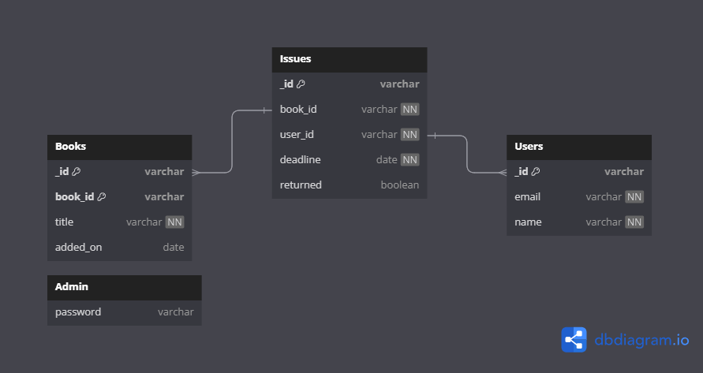

# Server
Backend for the frontend.

## Setting up the server locally

```bash
# cd into server folder
cd server

# install the dependencies
npm i

# make .env file from .env.example
cp .env.example .env

# start the development server
npm run dev
```

## Database Models

